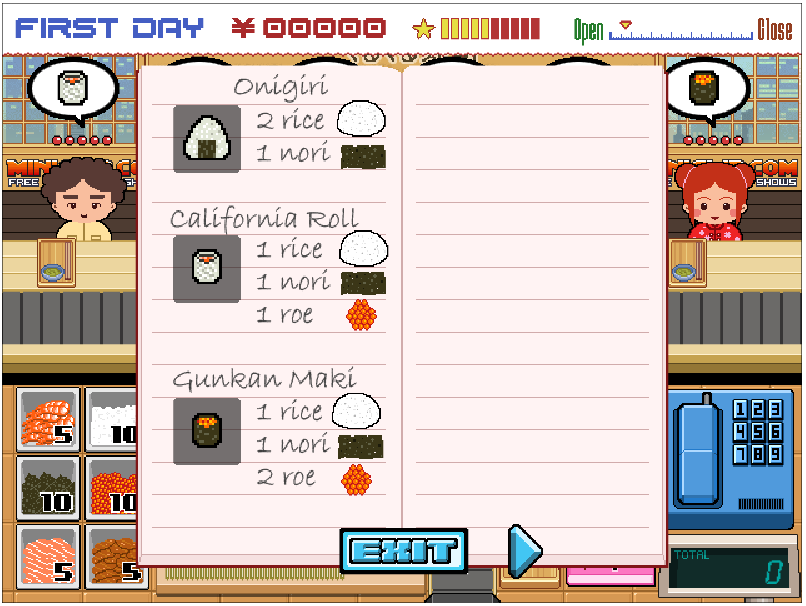
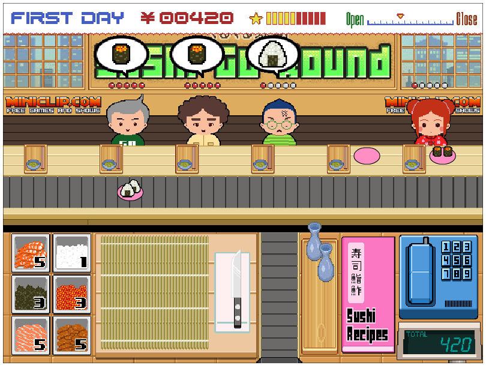
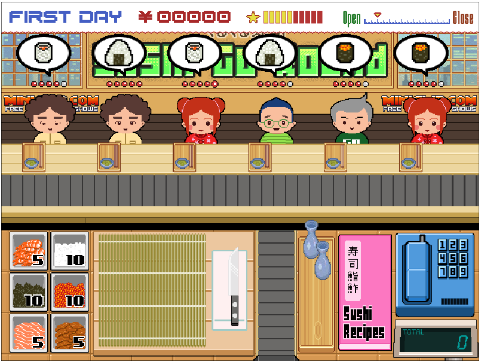

Sushi-Go-Round Bot
==================

This is a Python script which uses basic machine vision and hijacking the computer's mouse to play the Flash game Sushi-go-round. It was a lot of fun to make and refactor, but, it could still use a lot of polishing. It's able to beat the first level most of the time.

The initial bot was based off of [this tutorial](href="http://code.tutsplus.com/tutorials/how-to-build-a-python-bot-that-can-play-web-games--active-11117).

## Features

* The script works with any computer resolution
* Automated Sushi detection and preparation based on "machine vision"
* Automatic low ingredient refills (it even compensates for your budget!)
* Automatic plate clearing and menu skipping features
* Optimized to be less than 330 lines of code

## Links

* [Check out a demo of the script in action](https://vimeo.com/104863078)
* [The script playing a full round of Sushi-Go-Round](https://vimeo.com/104863211)

## Tools and libraries

`Python 2` using the `numPy`, `win32api`, `win32con`, and the `Pillow` libraries

## Possible to-do's:

* Refactor duplicate sections of code
* Add test coverage
* Research replacing browser finding with a framework like Selenium
* Make program modular for other flash games

## Setup

Setup should be pretty simple, especially if you are using a 1920 x 1080 resolution.

### For 1920 x 1080 users: 

Open [the game](http://www.miniclip.com/games/sushi-go-round/en/) and dock your browser on the right side of your screen (hold down the Windows / Super key and press the right arrow key until it's locked in).

You can check to make sure your mouse will line up with the ingame coordinates by running `screen_grab_debugging.py` or any of the screen grabbing functions.

### For everyone else: 

Open [the game](http://www.miniclip.com/games/sushi-go-round/en/") and dock your browser on the right side of your screen (hold down the Windows key and press the right arrow key until it's locked in).

The first thing you should do is run screen_grab_debugging.py to grab a shot of your screen. Inside of `sushi_bot.py` on lines 28 and 29 change `x_pad` and `y_pad` to the top left corner of the game (in the brown pixel between two black pixels). This can be done in Photoshop, Paint.net, or any other image editor of your choice. See section 2. Screen specific coordinates in `sushi_bot.py`.

After this is done, you might need to recalibrate the sushi grayscale sum (see code under 3. Grayscale sums).

## For Windows users

I had a problem with screen scaling (the screen shot will be too small) which can be turned off via `Control Panel > Display` (move it to the far left).

## Game screenshots

### The sushi ingredient menu

### The ordering queue

### A full house

